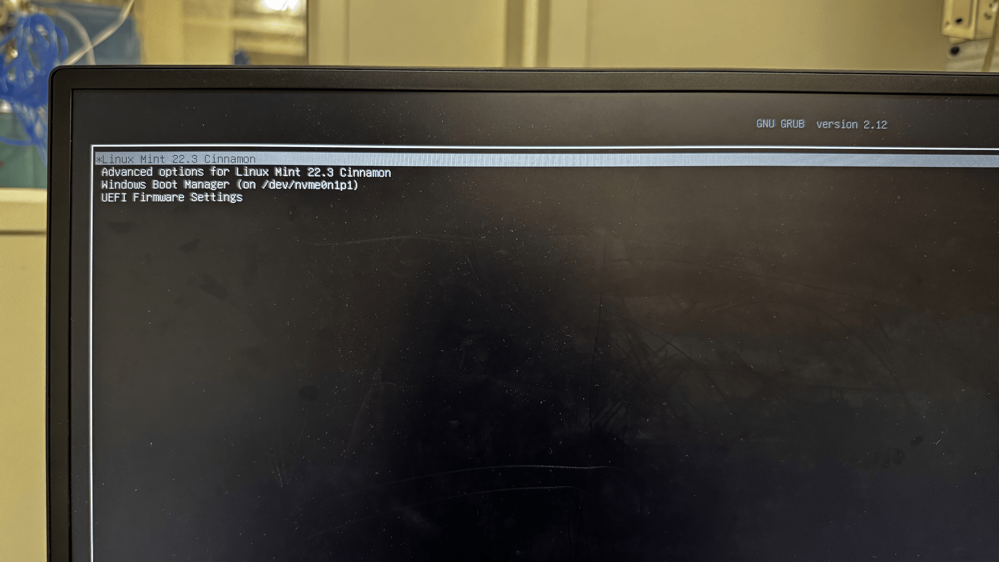
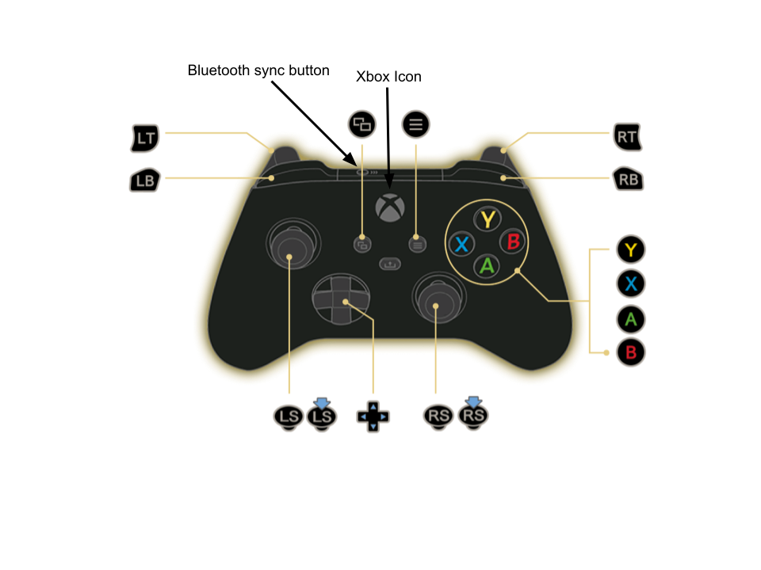
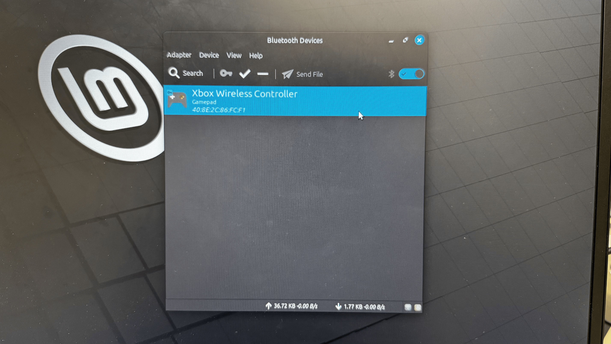
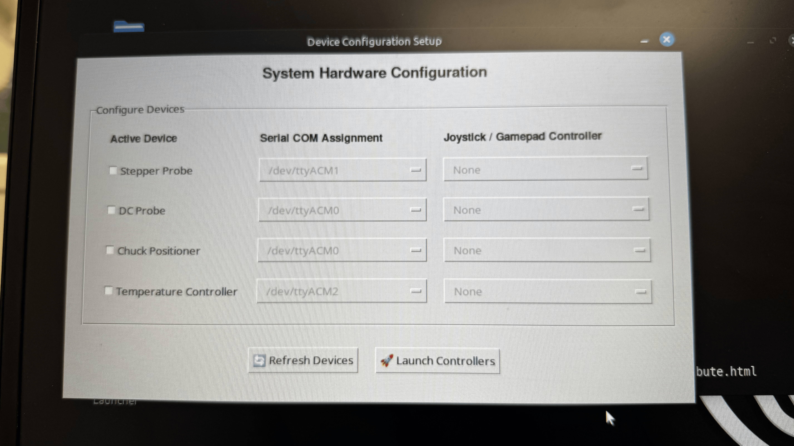
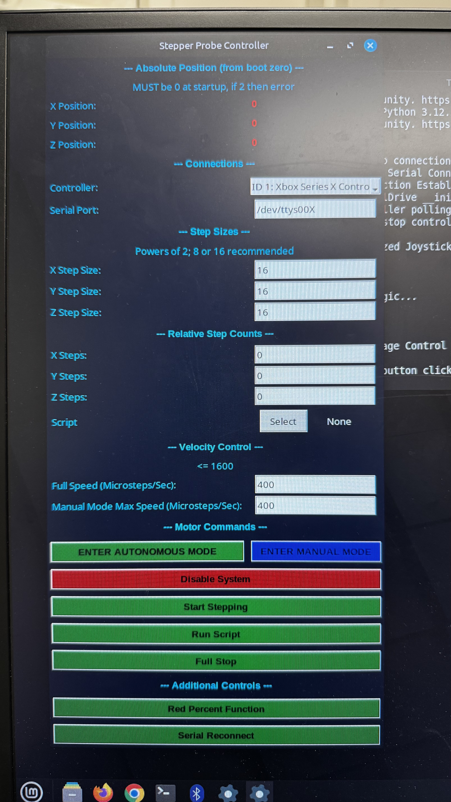
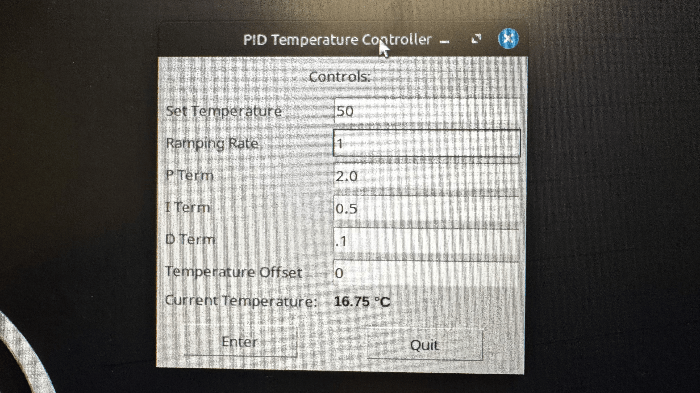
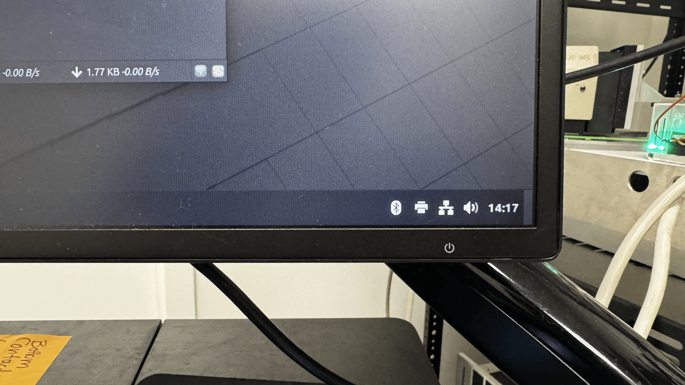

# Transfer Stage Unified Control System: Operating Procedures

This document outlines the standard procedures for system initialization, controller configuration, and software operation of the transfer stage devices.

## System Initialization and Operating System Selection

Upon powering on the PC, a *GRUB bootloader* menu will appear to select between Windows and Linux Mint.

> 
> *Figure 1: GRUB Bootloader Menu with Linux Mint and Windows options.*

- **Default Operating System**: If no selection is made, the system automatically boots into Linux Mint. This is the standard operating environment for the transfer stage.
- **Alternative Operating System**: To boot into Windows, use the arrow keys to select "Windows Boot Loader" and press Enter.
- To switch operating systems during a session, restart the PC using the power menu in the bottom left corner. A hard reboot is not required.

The password for both operating systems is located on the monitor attached to the transfer stage.

## Connecting the Xbox Controller

Prior to opening the software, the Xbox controller must be connected to the PC.

> 
> *Figure 2: Xbox Controller showing the central Xbox logo button and the pairing button.*

- **Wired Operation**: Connect the controller using the USB cable. Verify that the central Xbox logo is illuminated.
- **Wireless Operation (Bluetooth)**:
  1. Open the "Bluetooth Manager" located in the bottom right corner of the desktop.
  2. Power on the controller by holding the Xbox button until it lights up.
  3. Hold the pairing button on the top edge of the controller until the Xbox button flashes rapidly.
  4. Select the controller in the PC's Bluetooth menu and ensure its status is 'connected'.

> 
> *Figure 3a: Linux Bluetooth Manager icon.*
> 
> *Figure 3b: Linux Bluetooth Menu showing pairing.*

### Software Initialization

1. Double-click the **Transfer Stage Launcher** icon on the desktop.
2. A configuration GUI will open and automatically populate the available *COM ports*.
3. Use the drop-down menus on the right to assign the Xbox controller to each device.

> 
> *Figure 4: Configuration GUI showing the COM port drop-down menus.*

4. If the controller is not listed, verify the Bluetooth connection and click **Refresh Devices** to re-poll the connection list.
5. Click **Launch Controllers** to open the individual control windows.

## Software Operation

### Motion Controllers (Stepper, Chuck, DC)

The system operates in two main modes: **Autonomous** and **Manual**. Both modes include a **FULL STOP** emergency override button that halts all motion. Use this button immediately if a command is sent in error. 

To begin using the system in any operational mode, the **Enable System** button must be clicked first to establish active control.

> 
> *Figure 5a: Main control window (System Disabled).*
> 
> *Figure 5b: Main control window (System Enabled).*

- **Absolute Position**: This value represents the probe's current coordinates relative to its position when the software was initialized. It is used to track overall movement during a session.

#### Autonomous

This mode is used to move the probe by fixed, precise step amounts.

- **Step Sizes**: This applies a multiplier to the input. The minimum verified step size for each system is as follows:
  > - **Stepper**: `4` (approximately 1.25 micrometers). For example, with a step size of 5, an input of 100 steps will move the probe 500 counts. (A full step of 16 *microsteps* corresponds to exactly 5 microns).
  > - **DC**: UNVERIFIED
  > - **Chuck**: UNVERIFIED
- **Relative Step Counts**: Enter the desired X, Y, and Z step increments. The probe will move to the resulting coordinate. 
  > **Note**: Diagonal (multi-axis) movement is unverified. Restrict movement to a single axis at a time.
- **Full Speed**: Sets the constant speed of the probe during movement.
- **Execution**: Click **Start Stepping** to send the command.

> **Important**: Once a command is sent, it cannot be updated. To correct a mistake, click **FULL STOP**, wait for the probe to stop completely, and send a new command.

#### Manual

Manual mode allows for real-time movement of the stages using the Xbox controller. Ensure **Enable System** has been clicked prior to attempting joystick inputs.

- **Input Controls**: Use the analog thumbsticks to move along the X and Y axes. Use the analog triggers to move along the Z axis. The D-pad can also be used for discrete directional inputs.
- **Speed Limits**: The maximum speed during manual operation is determined by the 'Manual Mode Max Speed' field. For Stepper and Chuck controllers, this is set in Microsteps/Sec. For DC controllers, this sets the maximum *PWM* signal.
- **Stopping**: To halt continuous movement from the controller, click the **Full Stop** button. This will stop the system from reading controller inputs and halt the motors safely.

## Temperature Controller

The Temperature Controller module provides a dedicated interface for *PID* thermal management.

> 
> *Figure 6: Temperature Controller window showing the input fields and live temperature graph.*

- **Thermal Parameters**: Set the six required variables prior to execution:
  - **Set Temperature**: The target temperature you want the stage to reach and hold.
  - **Ramping Rate**: The speed at which the temperature should change to reach the target.
  - **P Term (Proportional)**: Determines how aggressively the system responds to the current error (the difference between the set and actual temperature).
  - **I Term (Integral)**: Accounts for past values of the error, helping to eliminate steady-state offset and ensuring the exact target is reached.
  - **D Term (Derivative)**: Predicts future error based on its rate of change, dampening the system to prevent overshooting the target temperature.
  - **Temperature Offset**: A calibration value used to correct any known discrepancies between the measured temperature and the actual physical temperature.
  Click **Enter** to send these parameters to the microcontroller and begin thermal regulation.
- **Data Display**: The interface continuously reads the *serial connection* data to update the 'Current Temperature' display. It also records a rolling history of the most recent 200 data points for time, temperature, and setpoint.
- **Closing the Module**: Click **Quit** to safely stop data polling and close the *serial connection* before the window exits.

## Troubleshooting Steps

### Common Troubleshooting

Perform these preliminary physical checks before reviewing software logs:

> 
> *Figure 7: Control box internal wiring highlighting the Arduino Mega, USB cables, and Jumper cables.*

1. **Connection Integrity**: Verify the *USB-A to USB-B cable* is securely connected from the internal *Arduino Mega* to the back of the PC. Each cutting box corresponds to one motion controller OR the temperature controller, and each should be clearly labeled on the front.
2. **Check the Jumpers**: Ensure all *Jumper cables* are firmly connected to the Arduino, the serial connector, and the power supply unit (PSU).
3. **Electrical Safety**: If any wires are loose or disconnected, do not touch them. Immediately unplug the PSU from the wall and disconnect the USB cable from the PC. Contact Carter or Ian.
4. **Terminal Prompts**: If the terminal window asks you to select a controller, type the number corresponding to the Xbox Controller and press Enter.

### Advanced Troubleshooting

If the physical setup is correct, check the terminal window or logs for the following errors:

> 📷 **Image Needed:** Screenshot of the terminal window showing where error logs and exception tracebacks typically appear.

- **`serial.SerialException`: Error establishing serial connection**
  - **Meaning:** The system cannot open the specified *COM port*. The device is disconnected, off, or the port is in use by another program.
  - **Resolution:** Verify the USB connection. Close any other software using the *COM port* and restart the application.

- **`ValueError`: Arduino not detected. Cannot enable/disable system.**
  - **Meaning:** A command to enable or disable the system (such as clicking **Enable System**) was issued, but the *serial connection* to the Arduino was lost or not established.
  - **Resolution:** Restart the software and ensure the correct *COM port* is selected in the GUI before enabling the system.

- **`serial.SerialTimeoutException`: WRITE TIMEOUT ERROR**
  - **Meaning:** The software sent data, but the Arduino did not respond in time.
  - **Resolution:** This indicates a frozen Arduino or a lost connection. Reset the Arduino, check the USB cable, and restart the software.

- **`pygame.error`: Pygame error during polling**
  - **Meaning:** The software lost communication with the Xbox controller.
  - **Resolution:** The controller's Bluetooth or wired connection has dropped. Reconnect the controller and ensure it is powered on.

- **`ValueError`: Unsupported joystick detected!**
  - **Meaning:** A controller is connected, but it is not the Xbox Series X Controller or T.16000M.
  - **Resolution:** Disconnect the unrecognized device and connect the approved Xbox controller.

- **Stagnant Position Tracking**
  - **Meaning:** If the absolute position stops updating without an error crashing the program, the serial data is likely being corrupted by electrical noise.
  - **Resolution:** Check that the *baud rate* is set to 500000. Ensure the USB cables are physically routed away from high-voltage power lines to minimize interference.

- **Xbox Controller Bluetooth Connection Loop (Dual-Boot Bug)**
  - **Meaning:** If the Xbox controller connects and disconnects rapidly in a loop within Linux, this is a known issue caused by conflicting Bluetooth pairing keys between the dual-boot Windows and Linux environments sharing the same Bluetooth *MAC address*. When the controller pairs with one OS, the other OS's key becomes invalid, leading to a connection loop.
  - **Resolution:** To resolve the synchronization conflict, follow this strict sequence:
    1. Reboot the PC into Windows.
    2. Open Windows Bluetooth settings and click **Forget Device** for the Xbox controller.
    3. Re-pair the controller to Windows, establishing a new connection to the network/Bluetooth adapter.
    4. Reboot the PC into Linux Mint.
    5. Open the Linux Bluetooth Manager, find the controller, and click **Forget Device**.
    6. Re-pair the controller in Linux as outlined in the *Connecting the Xbox Controller* section.
    *Note: This process resets the pairing keys on each end, allowing the Linux driver to properly negotiate the connection.*

For persistent issues, contact Carter or Ian via the lab Slack.

## Appendix

*Terms highlighted with asterisks in the text are defined below.*

- **Arduino Mega**: The microcontroller board inside the control box that acts as the "brain," receiving software commands from the PC and translating them into electrical signals to drive the hardware.
- **Baud rate**: The speed at which data is transmitted over the serial connection. Both the PC and the Arduino must be set to the exact same baud rate (e.g., 500000) to understand each other.
- **COM ports**: Communication ports. These are the digital channels on the PC used to establish a serial connection to the Arduino and other USB peripherals.
- **GRUB bootloader**: A small program that runs right when the computer turns on, presenting a menu to let you choose which operating system to load (Linux vs. Windows).
- **Jumper cables**: The small, colorful wires used inside the control box to connect the electronic components together.
- **MAC address**: A unique identifier assigned to a network interface controller (like a Bluetooth adapter) for communications.
- **Microsteps**: A technique used to move a stepper motor by a fraction of a full step, allowing for extremely precise, microscopic movements.
- **PID (Proportional-Integral-Derivative)**: A control loop feedback mechanism widely used in industrial control systems. In this context, it constantly calculates the error between the desired temperature and the actual temperature to smoothly apply heat without overshooting.
- **PWM (Pulse Width Modulation)**: A method of controlling the amount of power sent to a motor by rapidly turning the power on and off. A higher PWM threshold means the motor can receive more average power and spin faster.
- **Serial connection**: A type of communication where data is sent one bit at a time over a wire. This is how the PC talks to the Arduino Mega.
- **USB-A to USB-B cable**: The standard, squarish USB cable (often used for printers) connecting the PC (USB-A end) to the Arduino Mega (USB-B end).
