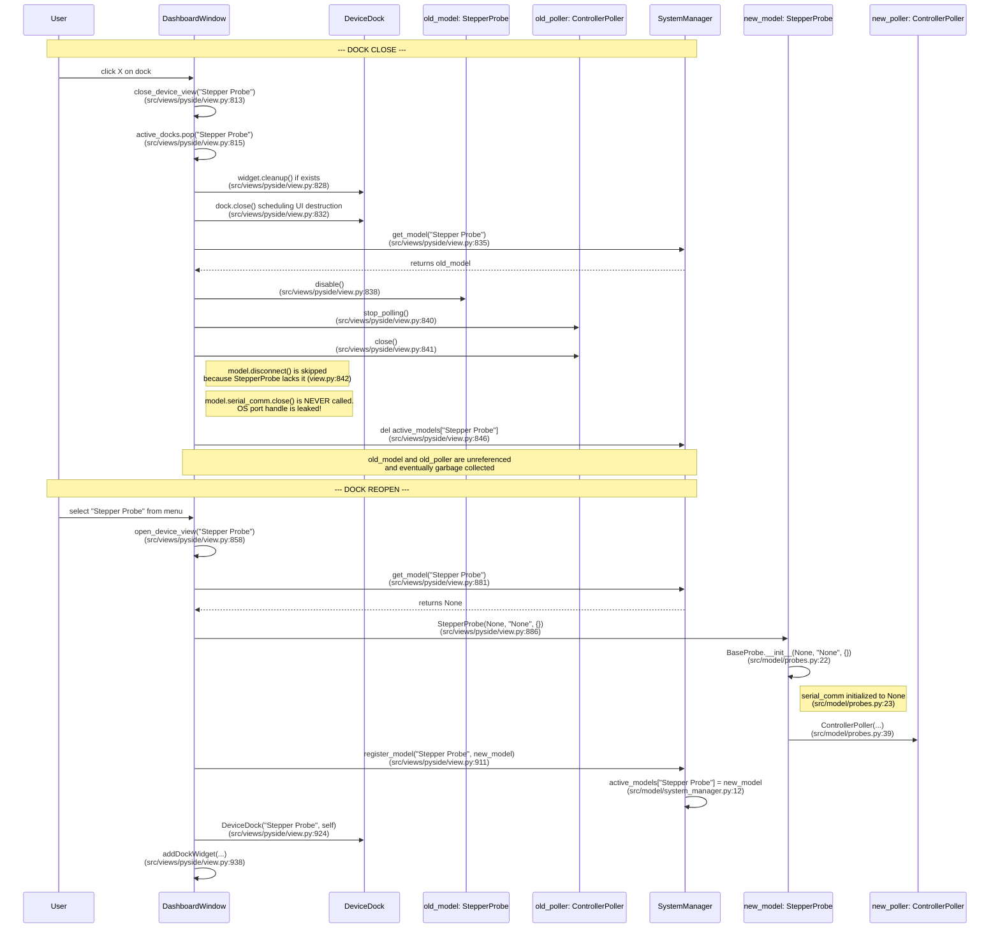

# Ownership & Lifecycle

> **2026-09-19 corrections (see [root-causes.md](root-causes.md) RC-1):**
> 1. `SystemManager.remove_model()` **does not** tear down. It only pops
>    the dict (`system_manager.py:24-27`). The fix recommended below
>    ("call `remove_model`, which internally calls `_teardown_model`")
>    would leak exactly as today. Only `reboot_model` and `shutdown_all`
>    call `teardown()`.
> 2. Reopen does **not** open a second `serial()` on the same port. PySide
>    `open_device_view` constructs with `port=None`, so the reopened device
>    is silently headless. The *old* handle is the leak.
> 3. Tk has **no** reopen flow. Tab close is `notebook.forget()` only, and
>    the model and all loops keep running.
> 4. `power_down()` ≠ `disable()`: `power_down` also writes `k`, which no
>    firmware handles.
> 5. The threading table's temperature "backoff" is a fixed 0.1 s retry
>    that gives up permanently after 5 failures.
>
> The two directions under "reconstruct on reopen" are now owner decision
> **D-1** in root-causes.md, with a recommendation.

The master map of who constructs what, who destroys it, and where the
`ManagedModel` contract (`teardown()` + `emergency_stop()`, see
[models.md](models.md#basemanagedmodel-protocol-srcmodelbasepy-22-lines))
is and isn't actually honored.

## Ownership graph (composition unless noted)

```
app.py / app_bootstrap.py
 └─ SystemManager                              (1 per app run)
     └─ active_models: dict[str, model]        (1 SystemManager : N models)
         ├─ StepperProbe / DCProbe / ChuckPositioner (BaseProbe)
         │   ├─ serial_comm: controller.serial.serial       (1:0..1, None if no port)
         │   └─ poller: controller.gamepad.ControllerPoller (1:1, always constructed)
         │       └─ gamepad: BaseGamepad subclass            (1:0..1, None until bound)
         ├─ RotatorSystem
         │   └─ smc: lib.smc100.SMC100                       (1:0..1)
         ├─ TemperatureSystem
         │   └─ serial_conn: controller.serial.serial        (1:0..1)
         │   └─ serial_thread: threading.Thread              (1:0..1, daemon, read_serial_data loop)
         └─ RedPercentSystem
             ├─ available_probes: dict[str, model]           (references, NOT owned --
             │                                                  aggregation, see below)
             ├─ data_log: RedPercentDataLog                  (1:0..1)
             └─ _monitor_thread: threading.Thread             (1:0..1, daemon)

view layer (PySide6 DashboardWindow / Tkinter DashboardWindow)
 └─ active_docks / tab_metadata: dict[str, dock/frame]
     └─ one QtDynamicView-or-subclass / DynamicView-or-RedPercentView per open device
         (references self.model -- does NOT own it; see close_device_view below
          for where this reference model breaks down)
```

`RedPercentSystem.available_probes` is the one clear **aggregation, not
composition** relationship in this codebase: it's populated by copying
references to *other* already-registered models
(`{n: m for n, m in system_manager.active_models.items() if hasattr(m, 'pos_x')}`,
`view.py:903` / mirrored in `app_bootstrap.build_models`) so the Red Percent
tab can log stepper position alongside color readings. If a probe model is
torn down while Red Percent still holds a stale reference to it in
`available_probes`, nothing currently re-syncs that dict — worth checking
if this becomes a reported issue (not yet confirmed as one).

## The three sanctioned lifecycle primitives (`SystemManager`)

```python
register_model(name, model) -> None
remove_model(name) -> model | None              # thread-safe pop
reboot_model(name, constructor, *args, **kwargs) -> model | None
    # remove_model -> _teardown_model (calls model.teardown()) -> sleep(1) -> constructor(...) -> register
shutdown_all() -> None                           # tears down every model via _teardown_model
full_stop_all() -> None                          # calls model.emergency_stop() on every model, no teardown
```

**These three are the only call sites in the entire codebase that route
through the `ManagedModel.teardown()` contract correctly.** Everywhere else
a model gets destroyed, something else reimplements a partial version of
teardown by hand — see below.

## The `close_device_view` divergence (PySide6, `view.py:813-847`)

When a device dock is closed, `DashboardWindow.close_device_view` does
**not** call `system_manager.remove_model()` or `model.teardown()`. It
reaches directly into `system_manager.active_models` and hand-rolls its own
shutdown sequence:

```python
if hasattr(model, 'disable'):        model.disable()          # = _stop_and_disarm(), not teardown()
if hasattr(model, 'poller') and model.poller:
    model.poller.stop_polling(); model.poller.close()          # duplicates part of teardown()
if hasattr(model, 'disconnect'):     model.disconnect()        # only RotatorSystem/TemperatureSystem have this
del self.system_manager.active_models[device_name]             # bypasses remove_model()
```

Compare against what `BaseProbe.teardown()` actually does:
```python
def teardown(self):
    if self.poller: self.poller.stop_polling(); self.poller.close()
    self.power_down()              # = disable() = _stop_and_disarm(), same as above -- OK
    if self.serial_comm: self.serial_comm.close()   # <-- NEVER CALLED by close_device_view
```

**Concrete bug, not yet fixed:** `BaseProbe` (and therefore `StepperProbe`,
`DCProbe`, `ChuckPositioner`) has **no `disconnect()` method** (confirmed by
grep — absent from the method inventory in models.md). So for every probe
device, `close_device_view`'s `if hasattr(model, 'disconnect')` branch never
fires, and `self.serial_comm.close()` is **never called** on dock close.
The OS-level serial port handle is leaked every time a probe's dock is
closed. Since `open_device_view` (for a device not already in
`active_docks`) then constructs a **brand-new model** with a **brand-new
`serial(port)`** for the *same physical port* (`app_bootstrap.build_models`-
style dynamic construction, `view.py:895-925`), you can end up with two
live `pyserial.Serial` handles open on the same OS port — behavior here is
platform-dependent (some OSes/drivers allow this and silently corrupt I/O,
others raise on the second open) but never correct.

For `RotatorSystem`/`TemperatureSystem`, `disconnect()` does exist and *is*
called — but note `disconnect() == teardown()`'s body verbatim for
`RotatorSystem` (`teardown = disconnect`), so those two are equivalent by
construction; this equivalence needs re-checking any time either method
changes, since nothing enforces it structurally.

**Why this matters beyond "flagged as untidy":** this is the same root
category of bug as the stepper coil-disable issue (fixed 2026-09-18) — a
call site reimplementing a partial version of a lifecycle method instead of
calling the sanctioned one, and the reimplementation silently missing a
step. The recommended fix direction (not yet applied — this needs a
decision, not a reflexive patch): make `close_device_view` call
`self.system_manager.remove_model(device_name)` (which internally calls
`_teardown_model` → `model.teardown()`) instead of hand-rolling the
sequence, and give `BaseProbe` a `disconnect()` = alias for whatever part of
`teardown()` is appropriate for a "close but might reopen" scenario if that
distinction is intentional (teardown might do more than a bare port-close
should) — this is a design call, not purely mechanical, since it touches
what "closing a dock" is supposed to mean session-to-session.

## The "reconstruct on reopen" pattern and why it matters for the gamepad bug history

`open_device_view` (PySide6, `:895-925`) and the equivalent Tkinter flow
both **construct a fresh model instance from scratch** when a device tab is
reopened and no model is currently registered — e.g.
`StepperProbe(None, "None", {})` for a probe with nothing pre-configured.
This is **not** "the same model, paused" — it's a brand-new Python object
with fresh state (`system_enabled=False`, no `serial_comm`, no assigned
controller) that the user then has to re-wire via the UI (port entry,
controller dropdown).

This pattern is exactly why the video-driver bug (fixed 2026-09-18, see
[known-issues.md](known-issues.md)) was a *recurring* bug and not a one-time
glitch: `BaseProbe.__init__` unconditionally constructs a new
`ControllerPoller`, which unconditionally attempts a pygame bind. Every dock
close/reopen cycle is therefore a full pygame construct/destroy cycle for
that probe, repeatedly exercising whatever edge case in pygame's
global-SDL-state teardown was broken. **This same reconstruct-on-reopen
pattern is also the plausible mechanism behind the newly-reported "manual
mode toggle visually desyncs after swapping controller" bug** — not yet
confirmed by targeted logging, see the hypothesis in
[known-issues.md](known-issues.md).

The two directions discussed for a deeper fix (not yet chosen/applied):
1. **Decouple controller/model construction from the view's dock lifecycle**
   — construct once at the `SystemManager` level, pass by reference into
   docks that get closed/reopened, so closing a dock hides the view without
   destroying the underlying hardware connection. Bigger, cross-cutting
   change (`app_bootstrap.py`, `SystemManager`, both view files).
2. **Keep reconstruct-on-reopen, but make every construct/destroy path
   provably correct** (the approach taken so far: fixing the pygame video
   driver centrally, fixing the coil-disable gating, fixing the serial-port
   leak once decided). Smaller, incremental, but leaves the "why does
   closing a tab throw away a live hardware connection" question
   unaddressed at the design level.

No decision has been made between these; option 2 is what's been executed
piecemeal so far because each individual bug was reported and fixed as it
surfaced. Worth a deliberate design conversation once the current bug
backlog is clear, rather than defaulting to option 2 by inertia.

## Threading model summary

| Component | Runs on | Synchronization |
|---|---|---|
| `BaseProbe`'s interlock watchdog | daemon `threading.Thread` | `threading.Event` (`_interlock_stop`) |
| `ControllerPoller` gamepad polling | driven by the view's timer (`QTimer`/`tk after`), not its own thread — `start_polling` schedules callbacks | N/A (runs on the GUI thread's event loop) |
| `TemperatureSystem.read_serial_data` | daemon `threading.Thread`, own loop with backoff on repeated failure (gives up after 5 consecutive) | `self._lock` around the shared history arrays |
| `RedPercentSystem._monitor_colors` | daemon `threading.Thread` (`mss`-based screen capture loop) | none visible on `current_red`/`red_change`/`baseline_red` — potential unguarded read/write race with the polling view reading these every tick; not yet confirmed as a live bug, flagged for follow-up |
| `RotatorSystem` async ops (`connect`, moves) | ad-hoc daemon `threading.Thread` per call via `_run_async` | `self._lock` around `smc`/`is_connected`/position state |
| Error popups | Any of the above → `ErrorRouter.report_*` → frontend-specific cross-thread marshaling (Qt signal / Tk queue) | see [error-routing.md](error-routing.md) |

## Dock Close/Reopen Sequence Diagram (`Stepper Probe`)

This diagram traces the exact objects created/destroyed and methods called during a close-then-reopen cycle for a `StepperProbe`, illustrating the port leak and reconstruct-on-reopen behavior described above.



---
*Last verified against commit `12e9d59` (2026-09-18) plus the two subsequent uncommitted fixes noted in [known-issues.md](known-issues.md).*

**Addendum (2026-09-18):** 
The `close_device_view` divergence described in this document was explicitly re-verified against the current source code (`src/views/pyside/view.py:813-847`). The hand-rolled teardown behavior—specifically the omission of `remove_model` and the conditional bypass of `disconnect()` which leads to the OS port handle leak—matches the current implementation exactly.
